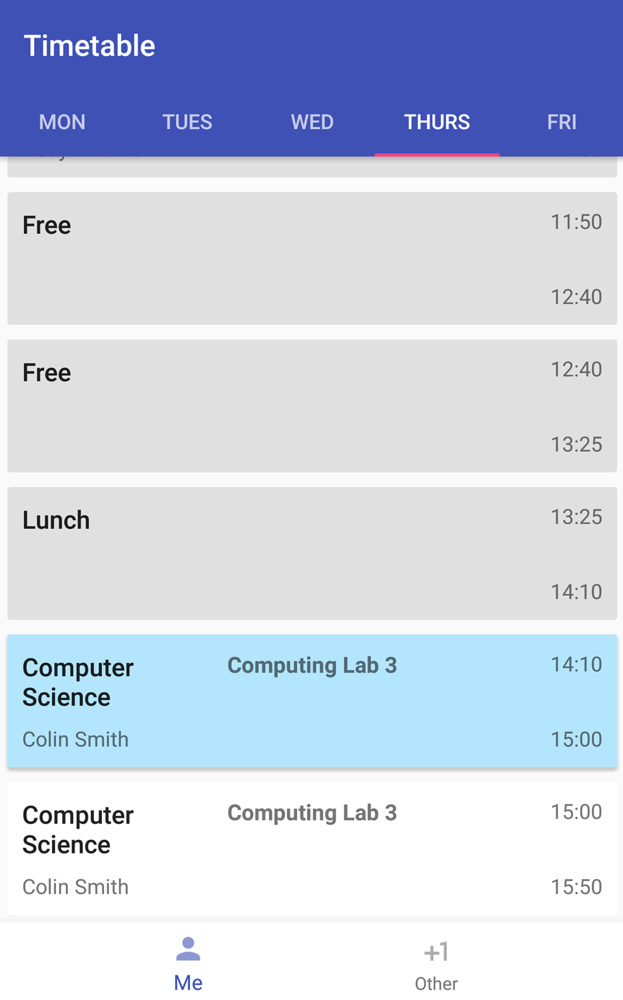

# Timetable App
This is an Android app which helps with keeping to schedules (e.g. classes). It also includes notifications to remind you near the time of where you have to be.
The current timeslot is selected in blue, with future ones being white. All past/completed slots are gray. The day is automatically selected.

